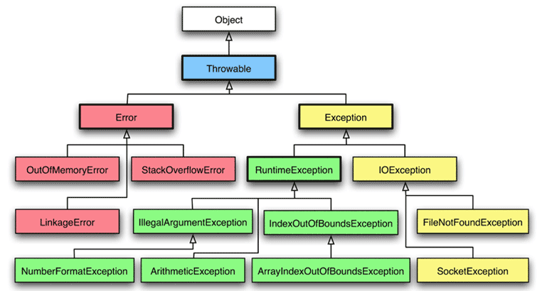

`String.format(
						"{"
						+ "\"key\": %s, \n"
						+ "\"number-left-pad\": %05d, \n"
						+ "\"float\": %.3f"
						+"}",  
						"doodle", 
						Integer.valueOf(100),
						1.2)`

**Diagrams**

**Next chapter**

WI/
 _search play! architecture explained
 https://github.com/l3nz/ObjectiveSync/blob/master/classes/ch/loway/oss/ObjectiveSync/SqlTools.java
 Java8 http://www.techempower.com/blog/2013/03/26/everything-about-java-8/
 
?/
 anonymous class is a form of closure

KEY/

 String 
   http://javarevisited.blogspot.ro/2013/07/java-string-tutorial-and-examples-beginners-programming.html 
   http://javarevisited.blogspot.ro/2011/07/string-vs-stringbuffer-vs-stringbuilder.html

 Classloader
   https://www.mulesoft.com/tcat/tomcat-classpath
   http://bitshub.blogspot.ro/2010/01/java-classloader.html
   http://docs.oracle.com/javase/7/docs/api/java/lang/ClassLoader.html

 *java.util.EventObject
 *Data Types
    Map  HashMap, Hashtable IdentityHashMap SortedMap
    Set  HashSet
    List ArrayList
    http://stackoverflow.com/questions/322715/when-to-use-linkedlist-over-arraylist
    MultiValueMap from Apache in order to link multiple values with one key (pk in table)
    TreeBasedTable class from Google guava 
    http://code.google.com/p/guava-libraries/wiki/LivingWithNullHostileCollections

 
    Conversii Map -> entrySet() -> Set

    Comparator
    ListIterator

    java.lang.ref.WeakReference;
    
    immutability/defensive copy technique 
    https://www.securecoding.cert.org/confluence/display/java/OBJ05-J.+Defensively+copy+private+mutable+class+members+before+returning+their+references 
    http://stackoverflow.com/questions/16061030/must-all-properties-of-an-immutable-object-be-final
    https://docs.oracle.com/javase/tutorial/essential/concurrency/imstrat.html
    http://stackoverflow.com/questions/8906284/all-immutable-types-in-java
    http://www.javapractices.com/topic/TopicAction.do?Id=29
    immutability effect: http://stackoverflow.com/questions/3815173/increment-a-integers-int-value

    Enumaration vs Iteration 
    Enumeration Vector, Hashtable
     hasMoreElements()
     nextElement()
    Iteration HashSet TreeSet HashMap Vector ArrayList
     hasNext()
     next()
     remove()
    external gson.internal.LinkedTreeMap, apache multimap, apache.commons.NameValuePair

PATTERNS/
 Java Development Kit Factory BorderFactory Decorator 
 Java EE patterns
 CERT Oracle Coding Standard for Java  https://www.securecoding.cert.org/confluence/x/Ux

?/
  JNDI http://tomcat.apache.org/tomcat-5.5-doc/jndi-datasource-examples-howto.htmlw
  What is a Functor
   command pattern <= functor pattern aka function object
  javax.naming.Context;
  java.util.ResourceBundle;
  java.text.ParseException;
  java.text.message format
  java.util.zip
 *java.security.Principal;

LIB/
 Apache commons 
    Object/Fule/Date/Word/StringUtils StringEscapeUtils EqualsBuilder HashCodeBuilder ToStringBuilder HttpClient CollectionUtils *Predicate BooleanUtils PropertiesConfiguration fileupload Validate CharUtils URLCodec/Base64 *FastDateFormat VelocityContext BeanComparator *XMLConfiguration builder.ToStringStyle
  com.google.gson/guava
  org.jfree ifreechart
  org.springframework.validation

CERTIFICATION/

 http://www.jchq.net/tutorial/introj2.htm
 http://www.jchq.net/tutorial/introj2.htm

 SCJP / OCPJP any edition (ex OCEJPAD) http://stackoverflow.com/questions/tagged/scjp
 SCJP affirms that the programmer really knows how to code, not to design and implement a complete 
  
 Oracle Certified Expert, Java Platform, Enterprise Edition 6 Java Persistence API Developer (1Z0-898) ex Sun Certified JPA Developer for the Java EE6 Platform (SCJPAD 6)
 OCJP - Exam 1Z0-851 - Oracle Certified Professional, Java SE 6 Programmer (former SCJP 310-065)
 February 2013 ÎíÎñ Present
 Exam 000-316 - IBM WebSphere Integration Developer V6.1 Application Development
 

NEXT/
 
  jsf primefaces/richfaces
  cdi
  ejb
  jpa hibernate/eclipselink
  jax-ws/jax-rs
  play! mvc (less jee)
  https://github.com/thombergs/wicked-charts; http://www.highcharts.com/

XVIIIth/
  download-bots (nbr, intercap), deck (gui with everything/weather, hackernews api, bnr quote...)
  it4 replacement
  recruitment historical records, with search (lucene)
  207
  all-platform it5 (http://stackoverflow.com/questions/2037220/how-can-i-creating-executable-jar-with-swt-that-runs-on-all-platforms)

KNOWN-WORLD/

  rishiri
     |-- dungeons
     |      |-- XVIIIth 
     |      |-- hellaStudy
     |	    |-- hellaStudy-jsp
     |	    |-- hsm (hyades skies matrix?) study codebase@w
     |
     |
     |-- wi/books
     |     |-- infoq
     |     |-- Thinking in Java/Java EE Patterns
     |
     |
     |-- certification
          
          

